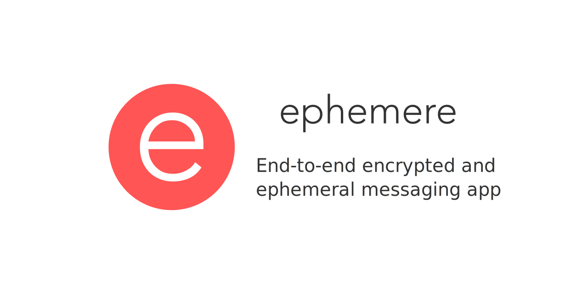

# Ephemere Branding

> Open a secure line

Graphical design files for Ephemere branding

## Design

### Fonts

- Avenir, Light
- Avenir Next, Normal

### Colors

- Red: `#ff5555`

### Logo

## Inspiration

This project has been greatly inspired by:

- [Griffonnage](https://github.com/griffonnage/griffonnage): end-to-end encrypted drawings
- [Magic Wormhole](https://github.com/warner/magic-wormhole): peer-to-peer secure file sharing
- [Magic Webhole](https://github.com/saljam/webwormhole): web-version of Magic Wormhole
- [Signal](https://www.signal.org): full-fledge secure multi-platform messaging

## License

Licensed under GNU Affero General Public License v3.0 (AGPLv3)

Copyright (c) 2021 - present Romain Clement

